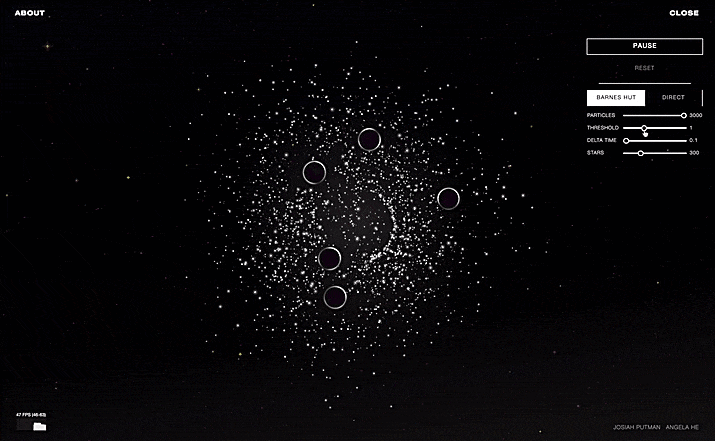

## About

Frontend for galaxy simulation using direct and Barnes-Hut algorithms.

Used [zephyo/Rust-Webpack-React-Sass-Template](https://github.com/zephyo/Rust-Webpack-React-Sass-Template).

Backend at [Katsutoshii/barnes-hut-rs](https://github.com/Katsutoshii/barnes-hut-rs).

For details on the algorithms, see the [barnes-hut-rs/README.md](https://github.com/Katsutoshii/barnes-hut-rs/blob/master/README.md).

<div align="center">



</div>

## Installation

```
git clone https://github.com/Katsutoshii/barnes-hut-frontend.git
git submodule update --init
npm install
```

## Publish to Github Pages

1. Create a Github Pages repo and replace galaxy-sim.github.io with your new repo.
2. `./publish.sh`
